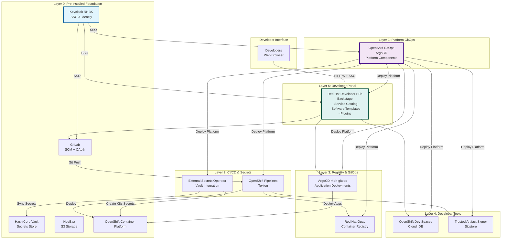
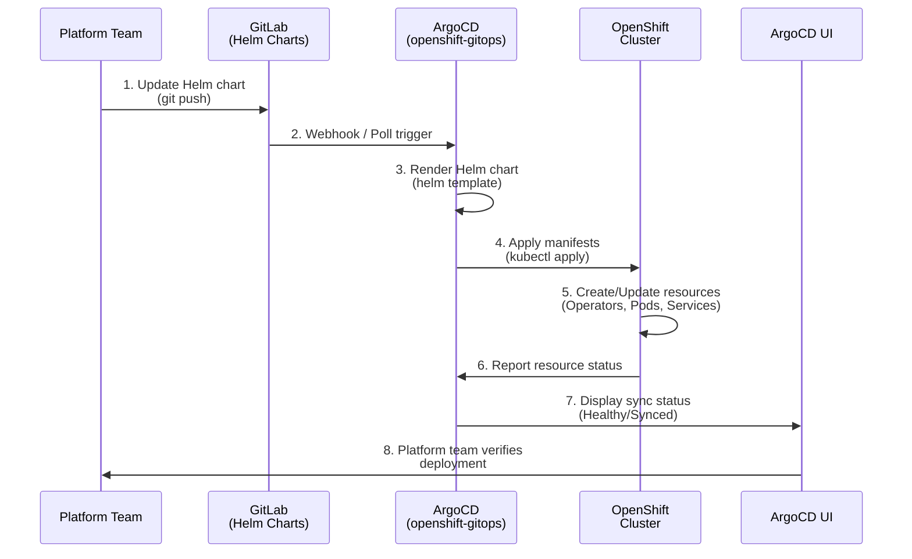
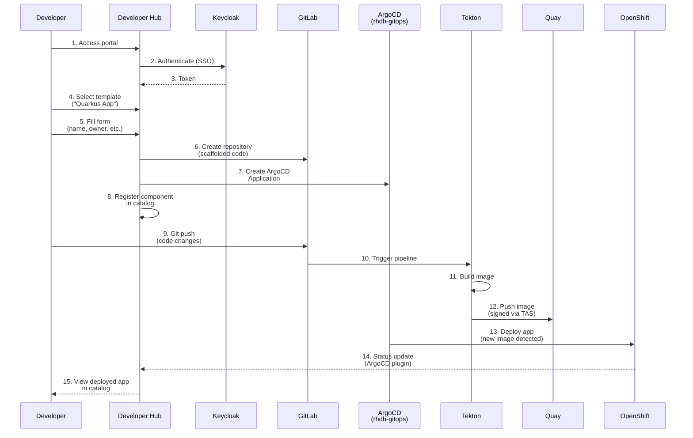
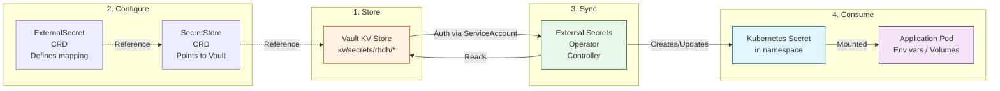
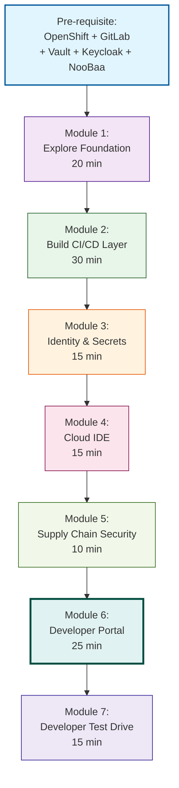
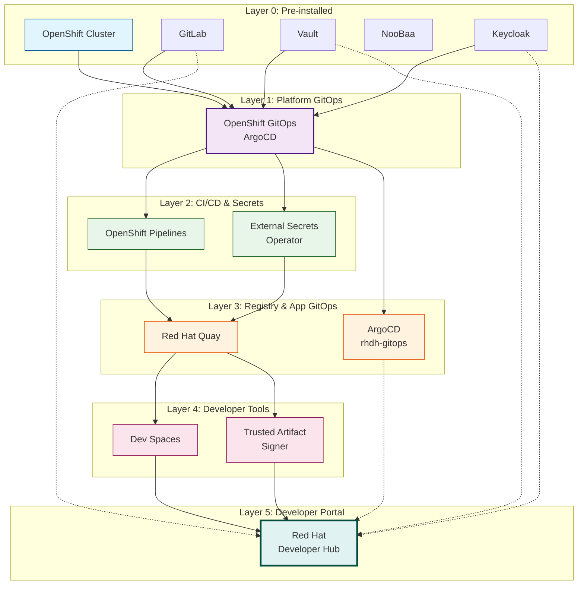
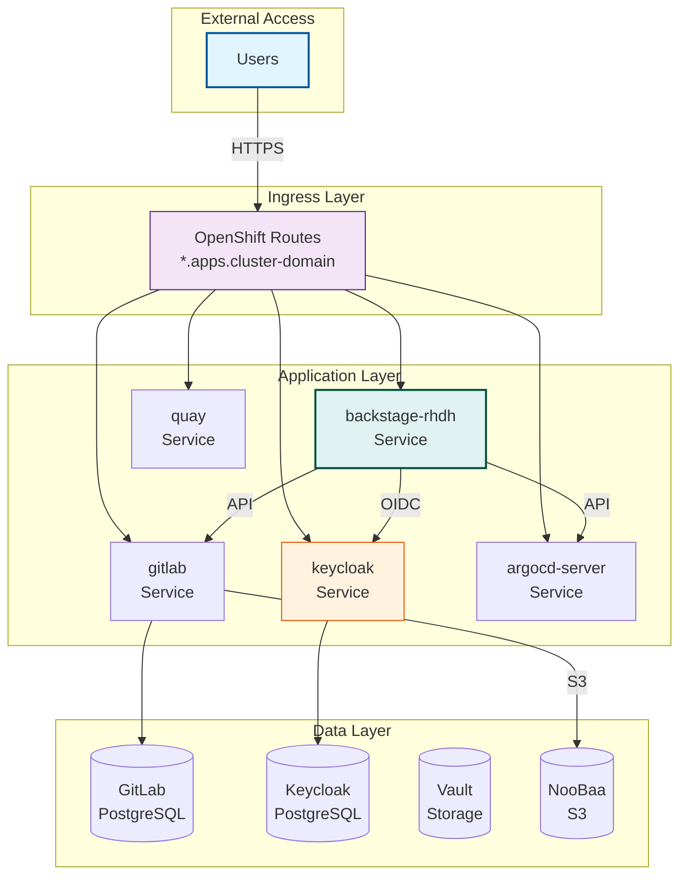

# Architecture Diagrams (Mermaid Format)

This file contains Mermaid diagrams for use in GitHub, GitLab, or other Markdown-rendering platforms that support Mermaid.

## Complete Platform Architecture



## GitOps Deployment Flow



## Developer Self-Service Flow



## Secret Management Flow



## Module Progression



## Component Dependencies



## Network Communication (Simplified)



## Usage

These diagrams can be rendered in:
- **GitHub**: Automatic rendering in `.md` files
- **GitLab**: Automatic rendering in `.md` files
- **VS Code**: With Mermaid extension
- **Documentation sites**: Many static site generators support Mermaid
- **Presentations**: Copy to tools like Marp, Slidev, or reveal.js

To convert to images:
```bash
# Using mermaid-cli
npm install -g @mermaid-js/mermaid-cli
mmdc -i DIAGRAMS.md -o diagrams-output/
```
